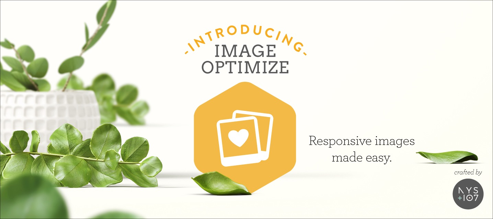
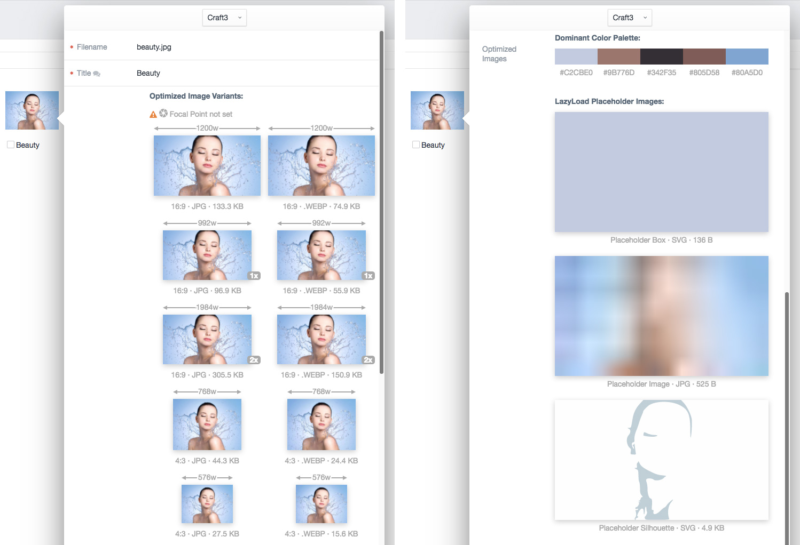
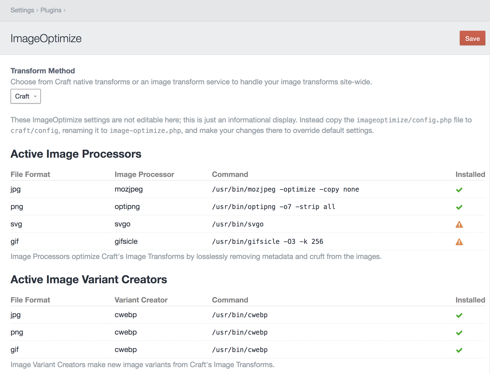
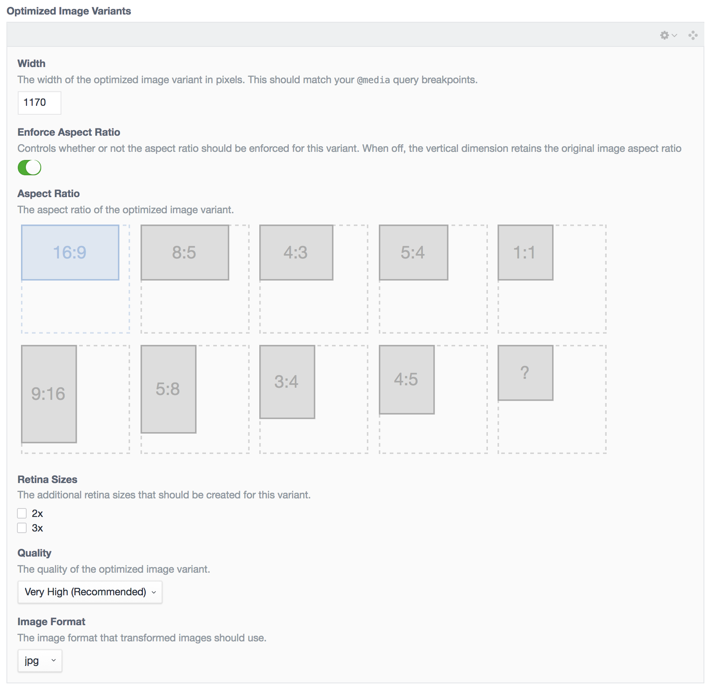
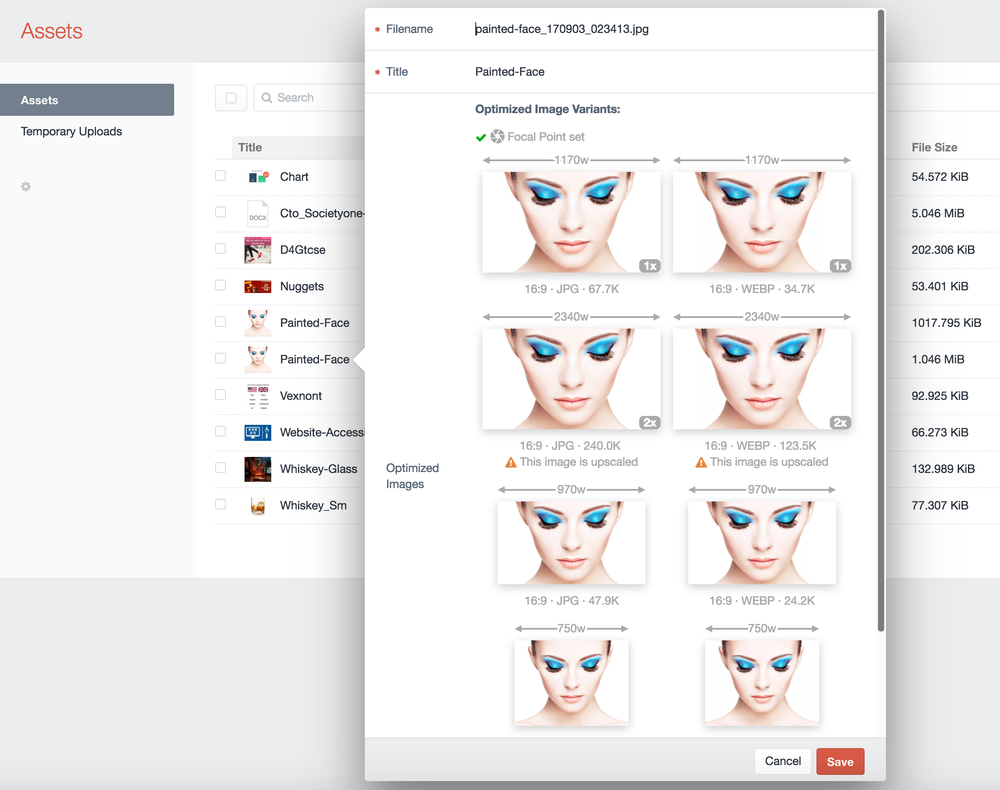
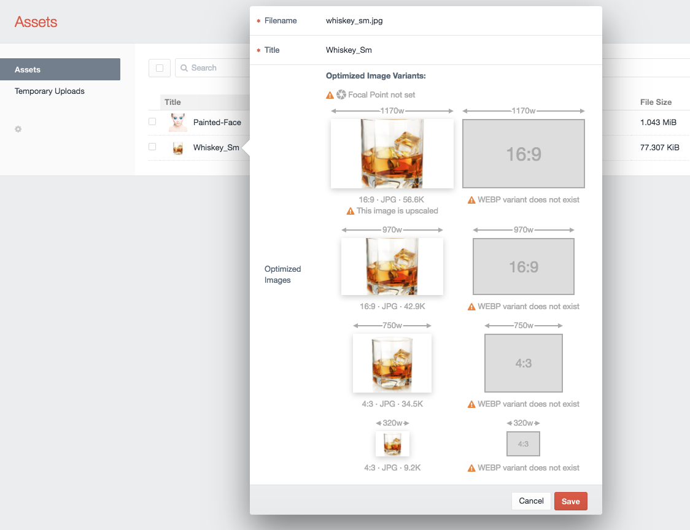
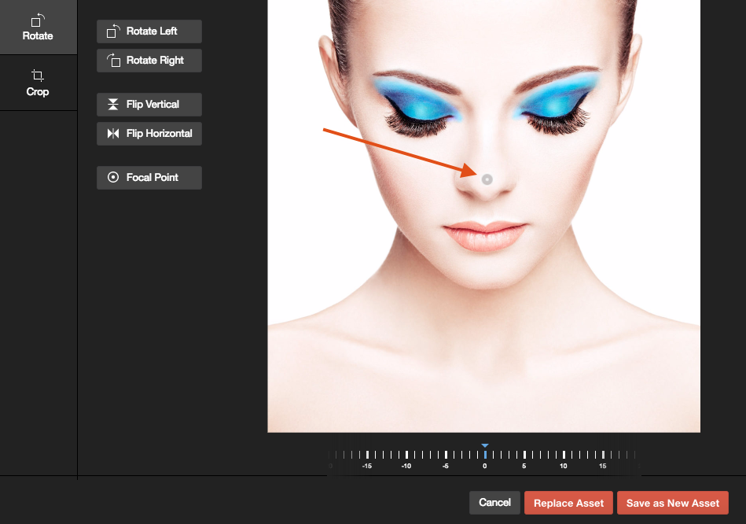
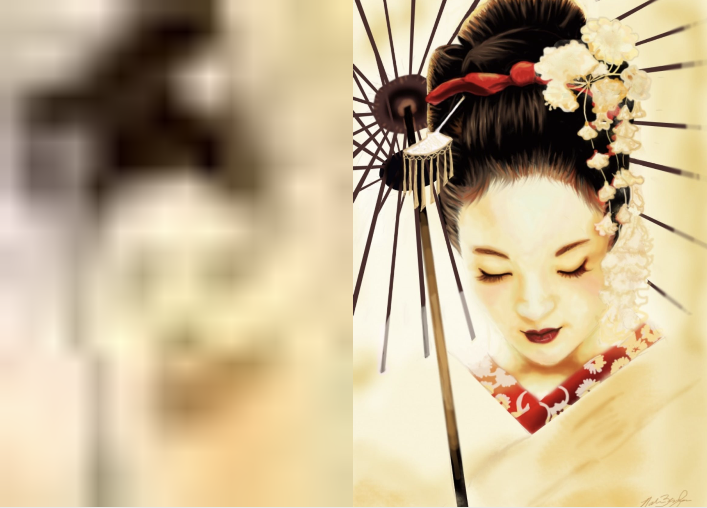
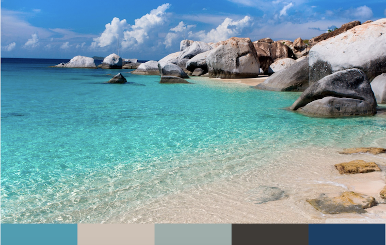
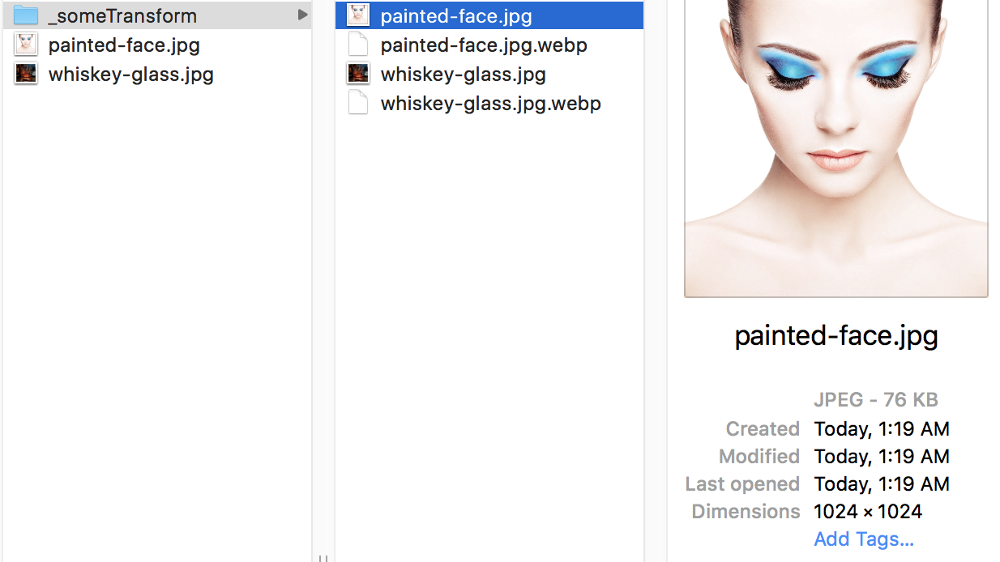

[](https://scrutinizer-ci.com/g/nystudio107/craft-imageoptimize/?branch=v1) [](https://scrutinizer-ci.com/g/nystudio107/craft-imageoptimize/?branch=v1) [](https://scrutinizer-ci.com/g/nystudio107/craft-imageoptimize/build-status/v1) [](https://scrutinizer-ci.com/code-intelligence)

# ImageOptimize plugin for Craft CMS 3.x

Automatically create & optimize responsive image transforms, using either native Craft transforms or a service like Imgix or Thumbor, with zero template changes.



**Note**: _The license fee for this plugin is $59.00 via the Craft Plugin Store._

## Requirements

This plugin requires Craft CMS 3.0.0 or later.

## Installation

To install ImageOptimize, follow these steps:

1. Install with Composer via `composer require nystudio107/craft-imageoptimize` from your project directory
2. Install plugin in the Craft Control Panel under Settings > Plugins

You can also install ImageOptimize via the **Plugin Store** in the Craft Control Panel.

ImageOptimize works on Craft 3.x.

If you want to use ImageOptimize with Cloudinary, install the [Cloudinary](https://github.com/timkelty/craft3-cloudinary) plugin that will make Cloudinary available as a file system for Craft CMS 3.

## ImageOptimize Overview



ImageOptimize allows you to automatically create & optimize responsive image transforms from your Craft 3 assets. It works equally well with native Craft image transforms, and image services like [Imgix](https://imgix.com) or [Thumbor](http://thumbor.org/), with zero template changes.

You use the native Craft UI/UX to create your image transforms, whether in the Control Panel or via your templates. ImageOptimize takes care of the rest, optimizing all of your image transforms automatically by running a variety of image optimization tools on them.

ImageOptimize also comes with an **OptimizedImages** Field that makes creating responsive image sizes for `` or `<picture>` elements sublimely easy. These responsive image transforms are created when an asset is _saved_, rather than at page load time, to ensure that frontend performance is optimal.

Because ImageOptimize has already pre-generated and saved the URLs to your optimized image variants, no additional database requests are needed to fetch this information (unlike with Assets or Transforms).

As configured by default, all of these are _lossless_ image optimizations that remove metadata and otherwise optimize the images without changing their appearance in any way.

Out of the box, ImageOptimize allows for the optimization of `JPG`, `PNG`, `SVG`, & `GIF` images, but you can add whatever additional types you want. It also supports using [Imgix](https://www.imgix.com/) or [Thumbor](http://thumbor.org/) to create the responsive image transforms.

It's important to create optimized images for frontend delivery, especially for mobile devices. If you want to learn more about it, read the [Creating Optimized Images in Craft CMS](https://nystudio107.com/blog/creating-optimized-images-in-craft-cms) article.

Once ImageOptimize is installed, optimized versions of image transforms are created without you having to do anything. This makes it great for client-proofing websites.

ImageOptimize works equally well with both local and remote assets such as Amazon S3 buckets.

## Configuring ImageOptimize

The plugin Settings for ImageOptimize allows you to choose whether to use native Craft image transforms, or an image transform service such as [Imgix](https://imgix.com) or [Thumbor](http://thumbor.org/). The setting you choose here will apply globally to all of your image transforms.

### Native Craft Images

To create client-proof optimized images with native Craft transforms, you'll need to also install the image optimization tools of your choice. The ImageOptimize plugin Settings page will show you the status of your installed image optimization tools:



Here's how to install a few on Ubuntu 16.04:

* **jpegoptim** - `sudo apt-get install jpegoptim`
* **mozjpeg** - [Installing mozjpeg on Ubuntu 16.04 (Forge)](https://nystudio107.com/blog/installing-mozjpeg-on-ubuntu-16-04-forge)
* **optipng** - `sudo apt-get install optipng`
* **svgo** - `sudo npm install -g svgo`
* **gifsicle** - `sudo apt-get install gifsicle`
* **webp** - `sudo apt-get install webp`

ImageOptimize's responsive image transforms will work without these tools installed, but it's recommended that you use them to ensure the images are fully optimized.

The only configuration for ImageOptimize is in the `config.php` file, which is a multi-environment friendly way to store the default settings.  Don't edit this file, instead copy it to `craft/config` as `image-optimize.php` and make your changes there.

The `activeImageProcessors` array lets you specify which of the image optimization tools to use for which file types.

The `imageProcessors` array specifies the path and options for each of the image optimization tools.

The `activeImageVariantCreators` array lets you specify which of the image variant creators to use for which file types.

The `imageVariantCreators` array specifies the path and options for each of the image variant creators.

See each image optimization tool's documentation for details on the options they allow you to use.

### Imgix Service Images

If you're using the [Imgix](https://imgix.com) service, ImageOptimize allows you to use the Craft Control Panel UX/UI to create your image transforms, but have Imgix do all of the heavy lifting for you. This means you can use Imgix with zero template changes.

Craft will then use Imgix for all Asset URLs, including the original image, its thumbnails, and any Asset transforms you create (whether in the Control Panel or via Twig templates).

To utilize Imgix, you'll need to enter your **Imgix Source Domain**, and your **Imgix API Key** to allow for auto-purging of changed Assets:


Then configure your Imgix source via your Imgix.com account. If you're using a Web Folder as a source, make sure it's set to the root of your domain, since you can only have one per site:


Regardless of how many separate Craft Asset Volumes you've set up, you'll just have one Web Folder source.

For image transforms, and set both **Quality** and **Format** to `Auto` in the Control Panel, it’ll send along `auto=compress,format` to Imgix, which will allow Imgix to compress the image as it sees fit. See the [Automatic Imgix Documentation](https://docs.imgix.com/apis/url/auto) for details.

You can also set an optional **Imgix Security Token** if you wish to have [secure, signed image URLs](https://docs.imgix.com/setup/securing-images) from Imgix.

## Using ImageOptimize

### Using the Optimized Images Field

To create responsive image variants for all of your images, create an **OptimizedImages** Field and add it to the Asset Volume field layout of the images you want optimized.

Think of each **Optimized Images** field as encapsulating a [srcset](https://cloudfour.com/thinks/responsive-images-101-part-4-srcset-width-descriptors/) for your images. If you need to use more than one `srcset` then you probably need more than one **Optimized Images** field.

**Transform Method** let you choose to use the built-in Craft transforms or a service like [Imgix](https://www.imgix.com/) for the responsive image variants.

You can then create as many Optimized Image Variants as you like:



You can add, delete, and re-order the Optimized Image Variants just like you can Matrix blocks.

For each Optimized Image Variant, set:
 
 * **Width**: The width of the image, which should correspond to your CSS `@media` query breakpoints or container sizes. For performance, we want to images to be the exact size that they will be displayed on-screen.
 * **Enforce Aspect Ratio**: Controls whether or not the aspect ratio should be enforced for this variant. When off, the vertical dimension retains the original image aspect ratio
 * **Aspect Ratio**: Pick an aspect ratio for the image from the available choices, or create your own with the `?` aspect ratio.
 * **Retina Sizes**: Check any additional retina sizes to create for this variant. For instance, a `100x60` image with with a `2x` retina size would _also_ create a `200x120` image.
 * **Quality**: The quality of the generated image; if **Auto** is selected, it will use your `config/general.php` setting for `defaultImageQuality`
 * **Image Format**: The file format of the generated image; if **Auto** is selected, it will use the original image's file format. It's recommended that you set this to `jpg` for most images, for client-proofing purposes.
 
 Once you have set up your field, add it to your asset Volume's layout via **Settings** &rarr; **Assets**, then click on your asset Volume, and click on **Field Layout**.

By default, ImageOptimize automatically will decrease the `quality` setting of retina images, as discussed in the [Retina revolution](https://www.netvlies.nl/tips-updates/design-interactie/design-interactie/retina-revolution/) article. This allows for increasing the visual quality of the retina images while keeping the file size modest. You can disable this via the `lowerQualityRetinaImageVariants` setting in `config.php`.

Whenever you add an OptimizedImages field to an asset Volume's layout, or make changes to an existing OptimizedImages field's settings, it will automatically generate your responsive image variants for you.

If you double-click on an asset (or click on an asset, and choose **Edit Asset** from the gear menu), you will now see all of your responsive image variants for that image:



You'll see the responsive width of each image variant above each thumbnail, with the aspect ratio, file format, and file size below it. If you have `.webp` image variants configured, you will see them here as well.

By default, ImageOptimize will not create Optimized Image Variants that would be up-scaled from the original source image. You can control this behavior via the `allowUpScaledImageVariants` setting in `config.php`.

If you click on an image thumbnail, it will open up the full size image in a new browser tab.

The OptimizedImages field also helps content editors by pointing out potential problems as well:



In this example, no **Focal Point** has been set via Craft 3's built-in image editor. The **Focal Point** lets content editors choose what portion of the image is most important, and should be kept in the center of any transformed images:



There are also warnings indicating that the original image is too small, and is being upscaled for one of the responsive variants, and that `WEBP` hasn't been configured, so there are no `.webp` variants created.

### Command line Optimized Image Variant creation

Because web-based PHP often has timeouts such as `max_execution_time` that can be exceeded by very large image variant creation, ImageOptimize comes with a command line utility to let you create the responsive image variants via console command.

From the root directory of your Craft CMS 3 project, you can use the following commands:

```
./craft image-optimize/optimize/create
```

If you want to generate only responsive image variants for a specific Asset Volume, you can do that by specifying the `handle` via the console command:

```
./craft image-optimize/optimize/create blogImages
```

Create all of the OptimizedImages Field variants by creating all of the responsive image variant transforms

```
./craft image-optimize/optimize/clear
```
Clear the Asset transform index cache tables, to force the re-creation of transformed images

Normally ImageOptimize will regenerate image variants if you change an OptimizedImages field, save the ImageOptimize preferences, or save an Assets Volume that contains an OptimizedImages field, to ensure that all of your image variants are in sync.

If you plan to do this manually via the above console commands, you can disable this behavior via the `automaticallyResaveImageVariants` setting in `config.php`.

### Dynamically creating Optimized Image Variants

If you wish to dynamically create Optimized Image Variants in your templates without having to use the Field.

**N.B.:** We recommend _against_ using Image Optimize via Twig if you can avoid it. If you create the Optimized Image Variants in your templates, the image transforms, placeholder images, and color palette extraction will all be done at pageload time. This means you'll miss out on the advantages of using the OptimizedImages field, where all of that computation is done when an Asset is saved.

To create Optimized Image Variants dynamically in your templates, you can do:

```


```

All of these fields are required, and they are analogous to the settings provided by the Field. The `retinaSizes` is an array of multipliers for the retina variants. For instance, if we wanted both normal resolution and 2x variants of the above image, we'd do:

```


```

You can create as many Optimized Image Variants as you like, by just including another array of settings. For example, to create both 200x and 400x image variants, we could do:

```
{% set optimzedImages = craft.imageOptimize.createOptimizedImages(
    someAsset,
    [
        {
            'width': 200,
            'useAspectRatio': true,
            'aspectRatioX': 1.0,
            'aspectRatioY': 1.0,
            'retinaSizes': ['1'],
            'quality': 82,
            'format': 'jpg',
        },
        {
            'width': 400,
            'useAspectRatio': true,
            'aspectRatioX': 1.0,
            'aspectRatioY': 1.0,
            'retinaSizes': ['1'],
            'quality': 82,
            'format': 'jpg',
        },
    ]
) %}

```

The `optimizedImages` object that is returned to you can be used in your templates as described in the *Displaying images on the frontend* section.

**N.B.:** Because they are lengthy operations, by default the generation of the dominant color palette and the generation of the placeholder silhouette are off. You can enable them via an additional parameter passed down to `craft.imageOptimize.createOptimizedImages`:

```


```

The third parameter is the `generatePlacholders` setting, which disables generating all placeholders and dominant color palette extraction.

### Displaying images on the frontend

ImageOptimize makes it easy to create responsive images in your frontend templates. There are two primary ways to create responsive images: using the `` element or using the `<picture>` element.

#### Img srcset

To use `` elements in your templates, you can just do:

```
    
    
```

...where `myAssetField` is your Assets field, and `optimizedImagesField` is your OptimizedImages field. This will result in HTML like this being generated for you:

```
    
```

The `.src()` method simply displays the first responsive image variant, and is typically just used as a fallback for browsers that don't support srcset. You can also pass in an optional `width` parameter to have it return a variant of that width:

```
    
    
```

There is also a corresponding `.srcWebp()` method, should you need it.

The `.srcset()` method displays all of the responsive image variants, with their associated source widths.

The `sizes` attribute here is a simple one that just matches the browser's width, but you can use any media query you like (and typically would have it match your CSS media query breakpoints or container sizes). For information on how `srcset` works, check out the excellent [Responsive Images 101, Part 5: Sizes](https://cloudfour.com/thinks/responsive-images-101-part-5-sizes/) article.

If you're using the [LazySizes](https://github.com/aFarkas/lazysizes) JavaScript for lazy image loading, your template code would look like this:

```
    
    
```

If you want to check to see if `.webp` is supported on the server so you can conditionally include `.webp` images, you can do:

```twig


```

#### Picture Elements

To use `<picture>` in your templates, you can just do:

```
    
    <picture>
        <source srcset="{{ optimizedImages.srcsetWebP() }}" 
                 sizes="100vw"
                 type="image/webp" />
        
     </picture>
```

...where `myAssetField` is your Assets field, and `optimizedImagesField` is your OptimizedImages field. This will result in HTML like this being generated for you:

```
    <picture>
        <source srcset="/assets/_1170x658_crop_center-center/painted-face.jpg.webp 1170w,
                         /assets/_970x545_crop_center-center/painted-face.jpg.webp 970w,
                         /assets/_750x562_crop_center-center/painted-face.jpg.webp 750w,
                         /assets/_320x240_crop_center-center/painted-face.jpg.webp 320w"
                 sizes="100vw"
                 type="image/webp" />
        
    </picture>
```

This assumes you have `WEBP` image variants configured. This lets the browser choose what to display, if it can handle `.webp`, it'll pick that (because `.webp` images are far more efficient than `.jpg` images), otherwise it'll just use the regular image.

The `sizes` attribute here is a simple one that just matches the browser's width, but you can use any media query you like  (and typically would have it match your CSS media query breakpoints or container sizes). For information on how `<picture>` works, check out the excellent [Responsive Images 101, Part 6: Picture Element](https://cloudfour.com/thinks/responsive-images-101-part-6-picture-element/) article.

If you're using the [LazySizes](https://github.com/aFarkas/lazysizes) JavaScript for lazy image loading, your template code would look like this:

```
    
    <picture>
        <source data-srcset="{{ optimizedImages.srcsetWebP() }}" 
                data-sizes="100vw"
                type="image/webp" />
        
     </picture>
```

#### Media Query srcset Sizes

If you need separate `srcset`s to match your media queries, you can use:

    
    {{ optimizedImages.srcsetWidth(970) }}
    {{ optimizedImages.srcsetWidthWebP(970) }}
   
...to output all variants that exactly match the passed in width (which could be more than one, if you have set up `2x` or `3x` retina variants).

If you want to use the mostly deprecated `1x`, `2x` DPR srcset syntax, you can do that by passing in `true`:

    
    {{ optimizedImages.srcsetWidth(970, true) }}
    {{ optimizedImages.srcsetWidthWebP(970, true) }}

To mimic the `min-width` media query, you can do:

    
    {{ optimizedImages.srcsetMinWidth(970) }}
    {{ optimizedImages.srcsetMinWidthWebP(970) }}

...to output all variants that match the passed in width or are larger than the passed in width (which also includes any `2x` or `3x` retina variants).

To mimic the `max-width` media query, you can do:

    
    {{ optimizedImages.srcsetMaxWidth(970) }}
    {{ optimizedImages.srcsetMaxWidthWebP(970) }}

...to output all variants that match the passed in width or are smaller than the passed in width (which also includes any `2x` or `3x` retina variants).

#### Placeholder Images

Image Optimize offers three different flavors of placeholder images you can display while the actual image is being lazy loaded via `lazysizes`. 

All of the placeholder images are stored in the Optimized Image field itself, so no http request is needed to fetch it, and the inline data used to generate them is very small.
 
The first is `.placeholderBox()` which displays a simple inline SVG with the background color set to the dominant color of the image:


(Placholder on the left, actual image on the right)

The second is `.placeholderSilhouette()` which displays an inline SVG silhouette generated from the original image:


(Placholder on the left, actual image on the right)

The SVG image itself will only be 300px wide, so apply CSS styles to it such as:

```
.responsive-img {
    width: 100%;
    height: auto;
}
```

The third is `.placeholderImage()`, which displays a tiny Instagram-style low resolution placeholder image to display while the image is being lazy loaded.


(Placholder on the left, actual image on the right)

The image itself will only be 16px wide, so apply CSS styles to it such as:

```
.responsive-img {
    width: 100%;
    height: auto;
}
```

For extra visual lusciousness, you could also apply a [CSS blur filter](https://css-tricks.com/almanac/properties/f/filter/) to the `.lazyload` class.

## Advanced Usage

### Color Palette

ImageOptimize extracts a color palette composed of the 5 most dominant colors used by an image that you can access from your templates:

```
    
    
        <div style="background-color: {{ color }}">
        </div>
    

```



Dominant Color Palette

These colors are sorted by color dominance, and can be used to style other HTML elements with complimentary colors.

### Iterating Through URLs

Should you want to iterate through the URLs individually, you can do that via:

```
    
    
        {{ url }}
    
    
        {{ url }}
    
```

Or to get the `width` as well as the `url`, you can do:

```
    
    
        {{ width ~ ' - ' ~ url }}
    
    
        {{ width ~ ' - ' ~ url }}
    

```

### Image Variant Height

Should you want to access the height of a given variant, you can do that via:

```twig
    
    {{ optimizedImages.variantHeight[VARIANT_WIDTH] }}
```

...where `VARIANT_WIDTH` is the width of the image variant.

Or to iterate through the `width` as well as the `height`, you can do:

```
    
    
        {{ width ~ ' - ' ~ height }}
    
```

### Arbitrary placeholder SVGs

Should you need to create an arbitrary placeholder SVG for lazy loading of images, you can do that via:

```


```

The method signature is `placeholderBox(WIDTH, HEIGHT, COLOR)`.

### Miscelaneous

The `maxSrcsetWidth()` method allows you to work around issues with `` returning sizes larger than are available as per the [Unexpected Image Sizes](https://medium.com/@MRWwebDesign/responsive-images-the-sizes-attribute-and-unexpected-image-sizes-882a2eadb6db) article. It returns the width of the largest Optimized Image Variant:

```
    
    
```

### Async Queue plugin

Normally ImageOptimize will regenerate image variants if you change an OptimizedImages field, save the ImageOptimize preferences, or save an Assets Volume that contains an OptimizedImages field, to ensure that all of your image variants are in sync.

Re-saving many images at a time can be intensive, and on certain setups may require tweaking the `php.ini` setting `max_execution_time`. An alternative for better handling of any lengthy Craft CMS task is the [Async Queue plugin](https://github.com/ostark/craft-async-queue).

All you need to do is install the plugin, and any queue jobs in Craft CMS 3 will now run entirely in the background via the CLI php, which isn't subject to the same restrictions that the web php is.

### GraphQL via CraftQL Plugin

ImageOptimize has built-in support for accessing the OptimizedImages field via GraphQL using the [CraftQL plugin](https://github.com/markhuot/craftql).

You can access all of the primary OptimizedImages field methods:

```
{
  entries(section:[homepage], limit:1) {
    ...on Homepage {
      title
      url
      someAsset {
        ...on AssetsVolume {
        title
        optimizedImages {
          ...on OptimizedImagesData {
            src,
            srcset,
            srcWebp,
            srcsetWebp,
            maxSrcsetWidth,
            placeholderImage,
            placeholderBox,
            placeholderSilhouette
            }
          }
        }
      }
    }
  }
}
```

...as well as all of the OptimizedImages field properties:

```
  entries(section:[homepage], limit:1) {
    ...on Homepage {
      title
      url
      someAsset {
        ...on AssetsVolume {
        title
        optimizedImages {
          ...on OptimizedImagesData {
            optimizedImageUrls,
            optimizedWebPImageUrls,
            variantSourceWidths,
            originalImageWidth,
            originalImageHeight
            placeholder,
            placeholderSvg,
            colorPalette,
            placeholderWidth,
            placeholderHeight
            }
          }
        }
      }
    }
  }
}
```

## Using Optimized Image Transforms

Once ImageOptimize is set up and configured, there's nothing left to do for optimizing your image transforms. It just works.

If you have `devMode` on, ImageOptimize will log stats for images that it optimizes, e.g.:

```
2017-03-12 07:49:27 [192.168.10.1][1][-][info][nystudio107\ImageOptimize\services\Optimize::handleGenerateTransformEvent] zappa.png -> Original: 129.5K, Optimized: 100.8K -> Savings: 28.4%
```

Image transforms that are scaled down >= 50% are auto-sharpened (controllable via the `autoSharpenScaledImages` setting in `config.php`). 


Normal scaled image on the left, auto-sharpened scaled image on the right.

## Image Variants

ImageOptimize can also automatically create image variants for transformed images. Whenever an image transform is created, ImageTransform can create the same image in multiple file formats.

This is especially useful when implementing [webp images](https://developers.google.com/speed/webp/), so that you can make `.webp` images available to browsers that support them, while falling back on traditional `.png` and `.jpg` images for browsers that don't.

Here's an example of what it looks like for images with the transform `Some Transform` applied to them:



The savings from using `.webp` can be significant, without sacrificing image quality:
 
 

`webp` also supports transparency, so it can be used as a viable substitute for both `.jpg` and `.png`

For `.webp` image variants, the suffix `.webp` is simply added to the name of the transformed image, so `painted-face.jpg` becomes `painted-face.jpg.webp`. So you can display the URL via `{{ entry.someAsset.one().getUrl('someTransform') ~ '.webp' }}`

To serve up `.webp` variant images, you can either use the HTML5 [&lt;picture&gt; element](https://www.html5rocks.com/en/tutorials/responsive/picture-element/#toc-file-type) to let browser choose what to display, or you can have your web server [serve them up automatically](https://github.com/uhop/grunt-tight-sprite/wiki/Recipe:-serve-WebP-with-nginx-conditionally). Some CDNs even support [serving up .webp images automatically](https://www.maxcdn.com/blog//how-to-reduce-image-size-with-webp-automagically/).

If you have `devMode` on, ImageOptimize will log stats for images that it creates variants for, e.g.:

```
2017-09-10 07:28:23 [192.168.10.1][1][-][info][nystudio107\imageoptimize\services\Optimize::createImageVariants] painted-face_170903_02341359b54c06c953b6.23303620.jpg -> painted-face_170903_02341359b54c06c953b6.23303620.jpg.webp -> Original: 36.9K, Variant: 12.8K -> Savings: 65.3%
```

## Writing an Image Transform

ImageOptimize was written in an extensible way so that you can write your own Image Transform method to work with any service you like. It comes with built-in support for Craft, Imgix, and Thumbor but you can add your own by writing a class that extends the `ImageTransform` abstract class:

```php
<?php

namespace vendor\package;

use nystudio107\imageoptimize\imagetransforms\ImageTransform;

class MyImageTransform extends ImageTransform
{
    // Your method overrides go here
}
```

The `ImageTransform` abstract class _extends_ `craft\base\SavableComponent` to allow it to display & save settings, and _implements_ `nystudio107\imageoptimize\imagetransforms\ImageTransformInterface` to handle the image transforms. See those classes, or the implemented `ImageTransform` classes in `nystudio107\imageoptimize\imagetransforms` for details.

Once you have your `ImageTransform` class, you need to let ImageOptimize know about it.

If your `ImageTransform` is a separate stand-alone Composer package, you can simply `composer require` your package, and add the class to your `config/image-optimize.php` multi-environment config file:

```php

use vendor\package\MyImageTransform;

...

    // The default Image Transform type classes
    'defaultImageTransformTypes' => [
        CraftImageTransform::class,
        ImgixImageTransform::class,
        ThumborImageTransform::class,
        MyImageTransform::class,
    ],
```

No module or plugin bootstrapping code needed to get it working.

If you want to wrap your `ImageTransform` into a plugin or module,
simply listen for the `EVENT_REGISTER_IMAGE_TRANSFORM_TYPES` to add your `ImageTransform` to the types that ImageOptimize knows about.

```php
use vendor\package\imagetransforms\MyImageTransform;

use nystudio107\imageoptimize\services\Optimize;
use craft\events\RegisterComponentTypesEvent;
use yii\base\Event;

Event::on(Optimize::class,
     Optimize::EVENT_REGISTER_IMAGE_TRANSFORM_TYPES,
     function(RegisterComponentTypesEvent $event) {
         $event->types[] = MyImageTransform::class;
     }
);
```

Although ImageOptimize itself uses the same mechanisms internally for `ImageTranform` implementations, this allows you to update & maintain an `ImageTransform` entirely independent of ImageOptimize.

## ImageOptimize Roadmap

Some things to do, and ideas for potential features:

* Consider supporting image optimization services like Cloudinary, TinyPNG, kraken.io, Uploadcare, and ImageOptim
* Add support for additional image optimization tools

Brought to you by [nystudio107](https://nystudio107.com)
