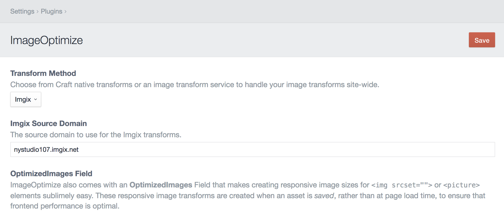
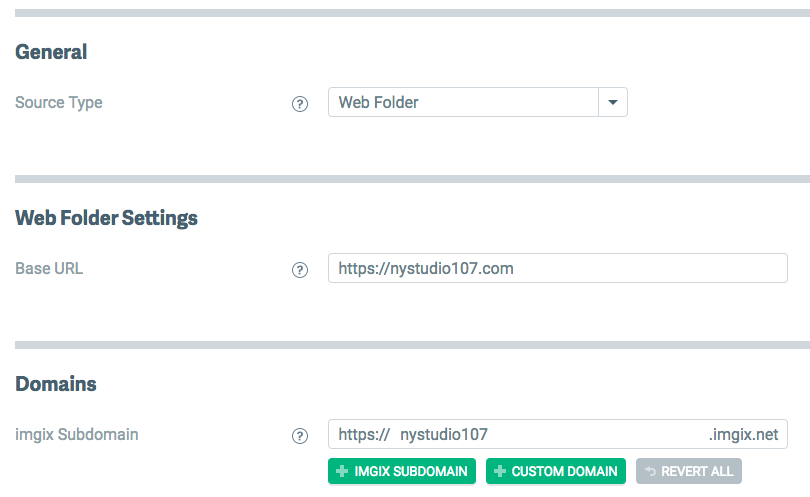
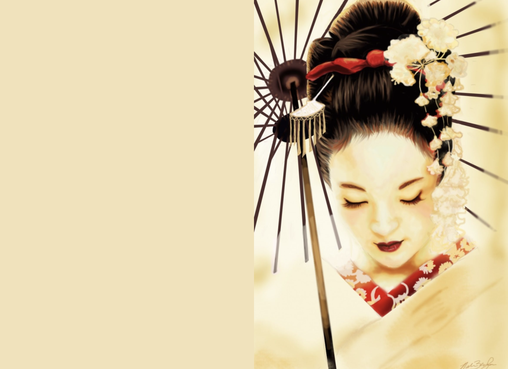
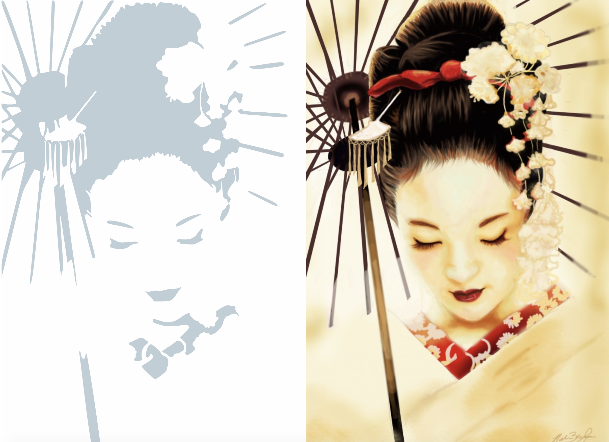

# ImageOptimize plugin for Craft CMS 3.x

Automatically create & optimize responsive image transforms, using either native Craft transforms or a service like Imgix, with zero template changes.

**Note**: This plugin may become a paid add-on when the Craft Plugin store becomes available.


## Installation

To install ImageOptimize, follow these steps:

1. Install with Composer via `composer require nystudio107/craft3-imageoptimize` from your project directory
2. Install plugin in the Craft Control Panel under Settings > Plugins

ImageOptimize works on Craft 3.x.

## ImageOptimize Overview

ImageOptimize allows you to automatically create & optimize responsive image transforms from your Craft 3 assets. It works equally well with native Craft image transforms, and image services like [Imgix](https://imgix.com), with zero template changes.

You use the native Craft UI/UX to create your image transforms, whether in the AdminCP or via your templates. ImageOptimize takes care of the rest, optimizing all of your image transforms automatically by running a variety of image optimization tools on them.

ImageOptimize also comes with an **OptimizedImages** Field that makes creating responsive image sizes for `` or `<picture>` elements sublimely easy. These responsive image transforms are created when an asset is _saved_, rather than at page load time, to ensure that frontend performance is optimal.

Because ImageOptimize has already pre-generated and saved the URLs to your optimized image variants, no additional database requests are needed to fetch this information (unlike with Assets or Transforms).

As configured by default, all of these are _lossless_ image optimizations that remove metadata and otherwise optimize the images without changing their appearance in any way.

Out of the box, ImageOptimize allows for the optimization of `JPG`, `PNG`, `SVG`, & `GIF` images, but you can add whatever additional types you want. It also supports using [Imgix](https://www.imgix.com/) to create the responsive image transforms.

It's important to create optimized images for frontend delivery, especially for mobile devices. If you want to learn more about it, read the [Creating Optimized Images in Craft CMS](https://nystudio107.com/blog/creating-optimized-images-in-craft-cms) article.

Once ImageOptimize is installed, optimized versions of image transforms are created without you having to do anything. This makes it great for client-proofing websites.

ImageOptimize works equally well with both local and remote assets such as Amazon S3 buckets.

## Configuring ImageOptimize

The plugin Settings for ImageOptimize allows you to choose whether to use native Craft image transforms, or an image transform service such as [Imgix](https://imgix.com). The setting you choose here will apply globally to all of your image transforms.

### Native Craft Images

To create client-proof optimized images with native Craft transforms, you'll need to also install the image optimization tools of your choice. The ImageOptimize plugin Settings page will show you the status of your installed image optimization tools:


Here's how to install a few on Ubuntu 16.04:

* **jpegoptim** - `sudo apt-get install jpegoptim`
* **mozjpeg** - [Installing mozjpeg on Ubuntu 16.04 (Forge)](https://nystudio107.com/blog/installing-mozjpeg-on-ubuntu-16-04-forge)
* **optipng** - `sudo apt-get install optipng`
* **svgo** - `sudo npm install -g svgo`
* **gifsicle** - `sudo apt-get install gifsicle`
* **webp** - `sudo apt-get install webp`

ImageOptimize's responsive image transforms will work without these tools installed, but it's recommended that you use them to ensure the images are fully optimized.

The only configuration for ImageOptimize is in the `config.php` file, which is a multi-environment friendly way to store the default settings.  Don't edit this file, instead copy it to `craft/config` as `image-optimize.php` and make your changes there.

The `activeImageProcessors` array lets you specify which of the image optimization tools to use for which file types.

The `imageProcessors` array specifies the path and options for each of the image optimization tools.

The `activeImageVariantCreators` array lets you specify which of the image variant creators to use for which file types.

The `imageVariantCreators` array specifies the path and options for each of the image variant creators.

See each image optimization tool's documentation for details on the options they allow you to use.

### Imgix Service Images

If you're using the [Imgix](https://imgix.com) service, ImageOptimize allows you to use the Craft AdminCP UX/UI to create your image transforms, but have Imgix do all of the heavy lifting for you. This means you can use Imgix with zero template changes.

To utilize Imgix, you'll need to enter your **Imgix Source Domain**:



Then configure your Imgix source via your Imgix.com account. If you're using a Web Folder as a source, make sure it's set to the root of your domain, since you can only have one per site:



Regardless of how many separate Craft Asset Volumes you've set up, you'll just have one Web Folder source.

## Using ImageOptimize

### Using the Optimized Images Field

#### In the AdminCP

To create responsive image variants for all of your images, create an **OptimizedImages** Field.

**Transform Method** let you choose to use the built-in Craft transforms or a service like [Imgix](https://www.imgix.com/) for the responsive image variants.

You can then create as many Optimized Image Variants as you like:


You can add, delete, and re-order the Optimized Image Variants just like you can Matrix blocks.

For each Optimized Image Variant, set:
 
 * **Width**: The width of the image, which should correspond to your CSS `@media` query breakpoints or container sizes. For performance, we want to images to be the exact size that they will be displayed on-screen.
 * **Enforce Aspect Ratio**: Controls whether or not the aspect ratio should be enforced for this variant. When off, the vertical dimension retains the original image aspect ratio
 * **Aspect Ratio**: Pick an aspect ratio for the image from the available choices, or create your own with the `?` aspect ratio.
 * **Retina Sizes**: Check any additional retina sizes to create for this variant. For instance, a `100x60` image with with a `2x` retina size would _also_ create a `200x120` image.
 * **Quality**: The quality of the generated image; if **Auto** is selected, it will use your `config/general.php` setting for `defaultImageQuality`
 * **Image Format**: The file format of the generated image; if **Auto** is selected, it will use the original image's file format. It's recommended that you set this to `jpg` for most images, for client-proofing purposes.
 
 Once you have set up your field, add it to your asset Volume's layout via **Settings** &rarr; **Assets**, then click on your asset Volume, and click on **Field Layout**.

Whenever you add an OptimizedImages field to an asset Volume's layout, or make changes to an existing OptimizedImages field's settings, it will automatically generate your responsive image variants for you.

If you double-click on an asset (or click on an asset, and choose **Edit Asset** from the gear menu), you will now see all of your responsive image variants for that image:


You'll see the responsive width of each image variant above each thumbnail, with the aspect ratio, file format, and file size below it. If you have `.webp` image variants configured, you will see them here as well.

If you click on an image thumbnail, it will open up the full size image in a new browser tab.

The OptimizedImages field also helps content editors by pointing out potential problems as well:


In this example, no **Focal Point** has been set via Craft 3's built-in image editor. The **Focal Point** lets content editors choose what portion of the image is most important, and should be kept in the center of any transformed images:


There are also warnings indicating that the original image is too small, and is being upscaled for one of the responsive variants, and that `WEBP` hasn't been configured, so there are no `.webp` variants created.

#### In your Templates

ImageOptimize makes it easy to create responsive images in your frontend templates. There are two primary ways to create responsive images: using the `` element or using the `<picture>` element.

##### Img srcset

To use `` elements in your templates, you can just do:

```
    
    
```

...where `someAsset` is your Assets field handle, and `optimizedImages` is the handle to your OptimizedImages field. This will result in HTML like this being generated for you:

```
    
```

The `.src()` method simply displays the first responsive image variant, and is typically just used as a fallback for browsers that don't support srcset.

The `.srcset()` method displays all of the responsive image variants, with their associated source widths.

The `sizes` attribute here is a simple one that just matches the browser's width, but you can use any media query you like (and typically would have it match your CSS media query breakpoints or container sizes). For information on how `srcset` works, check out the excellent [Responsive Images 101, Part 5: Sizes](https://cloudfour.com/thinks/responsive-images-101-part-5-sizes/) article.

If you're using the [LazySizes](https://github.com/aFarkas/lazysizes) JavaScript for lazy image loading, your template code would look like this:

```
    
    
```

##### Picture Elements

To use `<picture>` in your templates, you can just do:

```
    
    <picture>
        <sources srcset="{{ someAsset.one().optimizedImages.srcsetWebP() }}" 
                 sizes="100vw"
                 type="image/webp" />
        
     </picture>
```

...where `someAsset` is your Assets field handle, and `optimizedImages` is the handle to your OptimizedImages field. This will result in HTML like this being generated for you:

```
    <picture>
        <sources srcset="/assets/_1170x658_crop_center-center/painted-face.jpg.webp 1170w,
                         /assets/_970x545_crop_center-center/painted-face.jpg.webp 970w,
                         /assets/_750x562_crop_center-center/painted-face.jpg.webp 750w,
                         /assets/_320x240_crop_center-center/painted-face.jpg.webp 320w"
                 sizes="100vw"
                 type="image/webp" />
        
    </picture>
```

This assumes you have `WEBP` image variants configured. This lets the browser choose what to display, if it can handle `.webp`, it'll pick that (because `.webp` images are far more efficient than `.jpg` images), otherwise it'll just use the regular image.

The `sizes` attribute here is a simple one that just matches the browser's width, but you can use any media query you like  (and typically would have it match your CSS media query breakpoints or container sizes). For information on how `<picture>` works, check out the excellent [Responsive Images 101, Part 6: Picture Element](https://cloudfour.com/thinks/responsive-images-101-part-6-picture-element/) article.

If you're using the [LazySizes](https://github.com/aFarkas/lazysizes) JavaScript for lazy image loading, your template code would look like this:

```
    
    <picture>
        <sources data-srcset="{{ someAsset.one().optimizedImages.srcsetWebP() }}" 
                 data-sizes="100vw"
                 type="image/webp" />
        
     </picture>
```

##### Placeholder Images

Image Optimize offers three different flavors of placeholder images you can display while the actual image is being lazy loaded via `lazysizes`. 

All of the placeholder images are stored in the Optimized Image field itself, so no http request is needed to fetch it, and the inline data used to generate them is very small.
 
The first is `.placeholderBox()` which displays a simple inline SVG with the background color set to the dominant color of the image:


(Placholder on the left, actual image on the right)

The second is `.placeholderSilhouette()` which displays an inline SVG silhouette generated from the original image:


(Placholder on the left, actual image on the right)

The SVG image itself will only be 300px wide, so apply CSS styles to it such as:

```
.responsive-img {
    width: 100%;
    height: auto;
}
```

The third is `.placeholderImage()`, which displays a tiny Instagram-style low resolution placeholder image to display while the image is being lazy loaded.


(Placholder on the left, actual image on the right)

The image itself will only be 16px wide, so apply CSS styles to it such as:

```
.responsive-img {
    width: 100%;
    height: auto;
}
```

For extra visual lusciousness, you could also apply a [CSS blur filter](https://css-tricks.com/almanac/properties/f/filter/) to the `.lazyload` class.

#### Advanced Usage

##### Color Palette

ImageOptimize extracts a color palette composed of the 5 most dominant colors used by an image that you can access from your templates:

```
    
    
        <div style="background-color: {{ color }}">
        </div>
    

```


Dominant Color Palette

These colors are sorted by color dominance, and can be used to style other HTML elements with complimentary colors.

##### Iterating Through URLs

Should you want to iterate through the URLs individually, you can do that via:

```
    
    
        {{ url }}
    
    
        {{ url }}
    
```

Or to get the `width` as well as the `url`, you can do:

```
    
    
        {{ width ~ ' - ' ~ url }}
    
    
        {{ width ~ ' - ' ~ url }}
    

```

### Using Optimized Image Transforms

Once ImageOptimize is set up and configured, there's nothing left to do for optimizing your image transforms. It just works.

If you have `devMode` on, ImageOptimize will log stats for images that it optimizes, e.g.:

```
2017-03-12 07:49:27 [192.168.10.1][1][-][info][nystudio107\ImageOptimize\services\Optimize::handleGenerateTransformEvent] zappa.png -> Original: 129.5K, Optimized: 100.8K -> Savings: 28.4%
```

## Image Variants

ImageOptimize can also automatically create image variants for transformed images. Whenever an image transform is created, ImageTransform can create the same image in multiple file formats.

This is especially useful when implementing [webp images](https://developers.google.com/speed/webp/), so that you can make `.webp` images available to browsers that support them, while falling back on traditional `.png` and `.jpg` images for browsers that don't.

Here's an example of what it looks like for images with the transform `Some Transform` applied to them:


The savings from using `.webp` can be significant, without sacrificing image quality:
 
 

`webp` also supports transparency, so it can be used as a viable substitute for both `.jpg` and `.png`

For `.webp` image variants, the suffix `.webp` is simply added to the name of the transformed image, so `painted-face.jpg` becomes `painted-face.jpg.webp`. So you can display the URL via `{{ entry.someAsset.one().getUrl('someTransform') ~ '.webp' }}`

To serve up `.webp` variant images, you can either use the HTML5 [&lt;picture&gt; element](https://www.html5rocks.com/en/tutorials/responsive/picture-element/#toc-file-type) to let browser choose what to display, or you can have your web server [serve them up automatically](https://github.com/uhop/grunt-tight-sprite/wiki/Recipe:-serve-WebP-with-nginx-conditionally). Some CDNs even support [serving up .webp images automatically](https://www.maxcdn.com/blog//how-to-reduce-image-size-with-webp-automagically/).

If you have `devMode` on, ImageOptimize will log stats for images that it creates variants for, e.g.:

```
2017-09-10 07:28:23 [192.168.10.1][1][-][info][nystudio107\imageoptimize\services\Optimize::createImageVariants] painted-face_170903_02341359b54c06c953b6.23303620.jpg -> painted-face_170903_02341359b54c06c953b6.23303620.jpg.webp -> Original: 36.9K, Variant: 12.8K -> Savings: 65.3%
```

## ImageOptimize Roadmap

Some things to do, and ideas for potential features:

* Consider supporting image optimization services like Cloudinary, kraken.io, and ImageOptim
* Add support for additional image optimization tools

Brought to you by [nystudio107](https://nystudio107.com)
